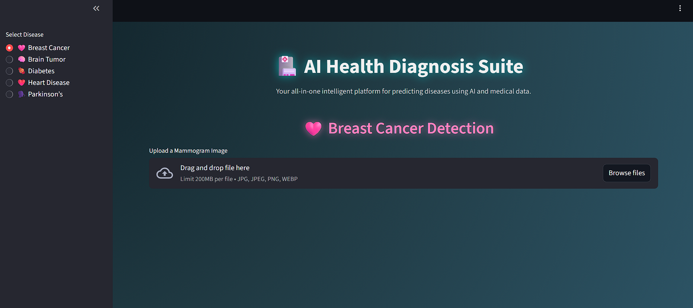
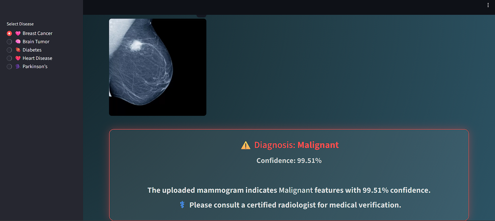
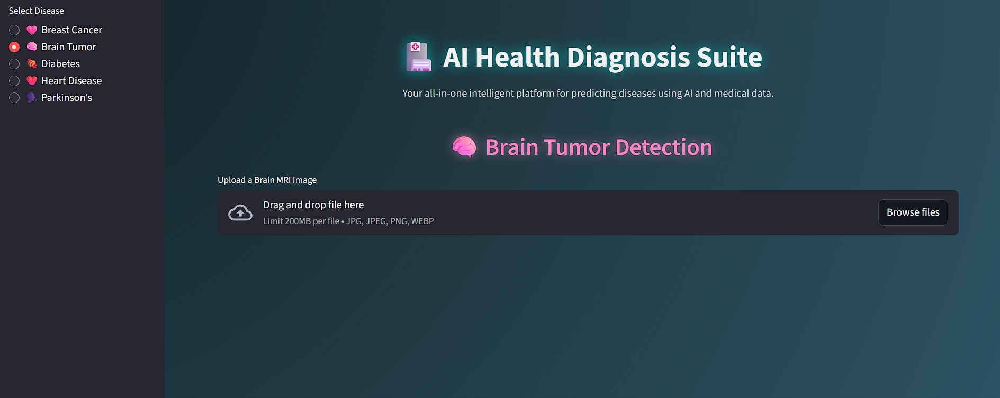
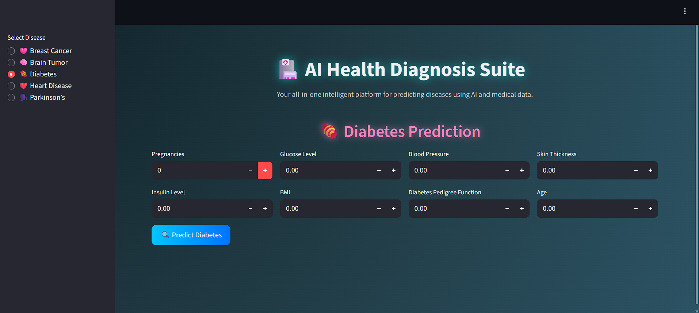
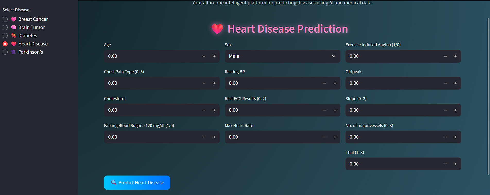
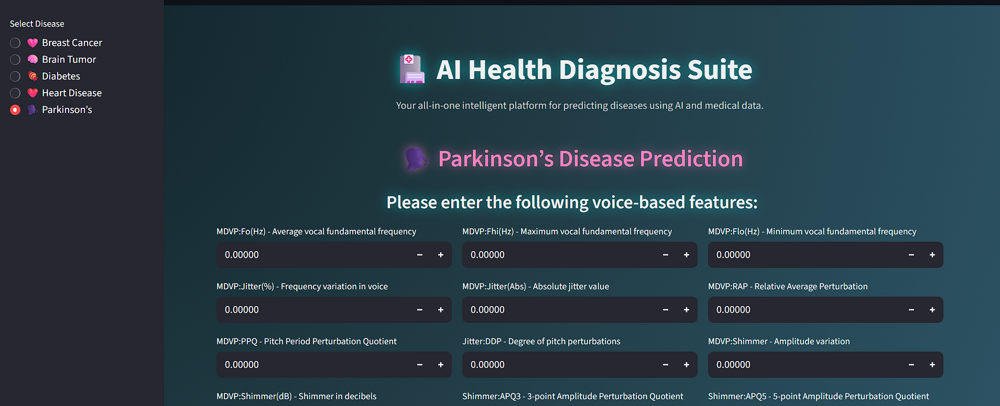

# 🏥 Multiple Disease Prediction System
[](https://multiple-disease-prediction-ad8hvas7nsmasidtzwrdry.streamlit.app/)

AI-powered web application for predicting multiple diseases using Machine Learning and Deep Learning.

## 📋 About

This Streamlit web application predicts five different diseases using trained ML/DL models:

- 🩷 **Breast Cancer** - CNN (EfficientNet)
- 🧠 **Brain Tumor** - Custom CNN  
- 🍬 **Diabetes** - Random Forest
- ❤️ **Heart Disease** - Logistic Regression
- 🗣️ **Parkinson's Disease** - SVM

## 🌐 Live Demo
👉 **[Try the app here](https://multiple-disease-prediction-ad8hvas7nsmasidtzwrdry.streamlit.app/)**

## 📸 Screenshots

### Breast Cancer Detection



### Brain Tumor Detection


### Diabetes Prediction


### Heart Disease Prediction


### Parkinson's Disease Prediction


## 🛠️ Tech Stack

- **Python 3.12**
- **Streamlit** - Web framework
- **TensorFlow/Keras** - Deep learning models
- **Scikit-learn** - Machine learning models
- **Google Drive** - Model storage

## 📁 Project Structure

```
multiple-disease-prediction/
│
├── app.py                      # Main application
├── requirements.txt            # Dependencies
├── Dockerfile                  # Docker config
│
├── saved_models/               # Pre-trained models
│   ├── breast_cancer_model_last.h5
│   ├── Brain_Tumor_Classification_model_fixed.h5
│   ├── diabetes_model.sav
│   ├── heart_disease_model.sav
│   └── parkinsons_model.sav
│
├── Screenshots/                # App screenshots
│
└── temp_backup/                # Backup files
```

## 🚀 Installation

**1. Clone the repository**
```bash
git clone https://github.com/sukhijashivam/multiple-disease-prediction.git
cd multiple-disease-prediction
```

**2. Install dependencies**
```bash
pip install -r requirements.txt
```

**3. Run the application**
```bash
streamlit run app.py
```

**4. Open browser**
- Navigate to `http://localhost:8501`
- Models auto-download on first run

## 💻 How to Use

### For Image-Based Predictions (Breast Cancer, Brain Tumor)
1. Select disease from sidebar
2. Upload medical image (JPG, JPEG, PNG)
3. Click "Predict"
4. View results with confidence score

### For Data-Based Predictions (Diabetes, Heart Disease, Parkinson's)
1. Select disease from sidebar
2. Enter required medical parameters
3. Click "Predict"
4. View prediction results

## 🧠 Models

| Disease | Model | Input Type | Features |
|---------|-------|------------|----------|
| Breast Cancer | CNN (EfficientNet) | Mammogram Image | Image classification |
| Brain Tumor | Custom CNN | MRI Image | Image classification |
| Diabetes | Random Forest | Clinical Data | 8 parameters |
| Heart Disease | Logistic Regression | Clinical Data | 13 parameters |
| Parkinson's | SVM | Voice Data | 22 features |

## ⚠️ Disclaimer

**This application is for educational purposes only.** It is NOT a substitute for professional medical advice, diagnosis, or treatment. Always consult qualified healthcare providers for medical decisions.

## 👨‍💻 Author

**Shivam Sukhija**
- GitHub: [@sukhijashivam](https://github.com/sukhijashivam)
- Email: shivamsukhija002@gmail.com

## 📄 License

MIT License - feel free to use this project for learning and development.

## 🙏 Acknowledgments

- Kaggle for datasets
- Streamlit for the framework
- TensorFlow and Scikit-learn communities

---

⭐ If you find this project helpful, please star the repository!
